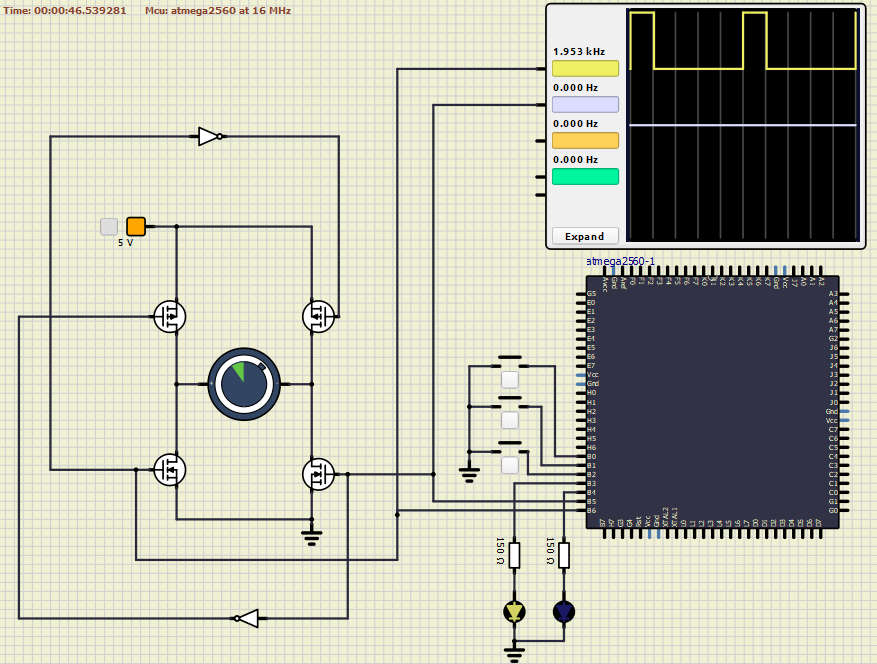

# DC motor controller with Atmega2560

The following firmware was developed for an Atmega2560 µC (Atmel - AVR architecture 8bit) by using the C synthax and permits the control of a DC motor through tree pushbuttons (two for incrementing and decrementing (PB0 and PB1) the RPMs of the electro-mechanical device, while the third (PB2) for inverting the rotation sense).

The methodology of management was done by adopting the "Fast PWM" control technique with resolution 2^10bits (0-1023 steps).
This means that two different digital output pins (PB5 and PB6) were configured to act as PWM waves to properly control the motor according to the requested rotation speed.
The output steps were however scaled in order to have a proper association of the physical clicks of the pushbuttons with a δ -duty cycle- ranging from 0 (motor OFF) to 100% (max speed); each step is hence increasing/decreasing the previous count value by int(10.23). <br>
```c
#define TOP_VAL 1023
//OTHER CODE
uint16_t res = 0;
res = ((TOP_VAL / 100.0)) * duty;
``` 

An H-Bridge composed by 4 mosfet was placed as intermediate component between microcontroller and motor in order to deal with the current limitations of the output ports of the Atmega and to correctly manage the current flow through the device.

**Extra's**: The implementation was successfully tested with SimulIde simulation environment.

## Technologies used: C, Atmega2560 µC, PWM wave, embedded systems



